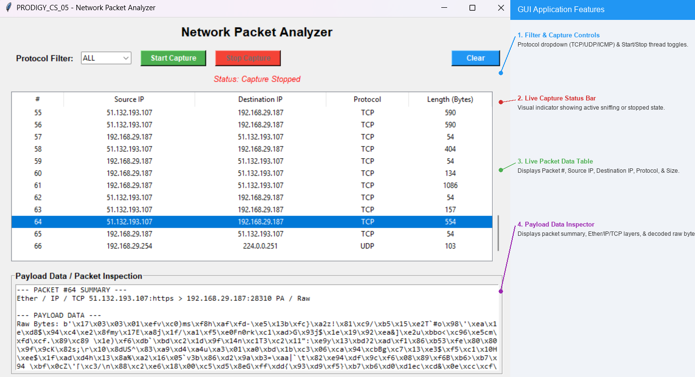

# PRODIGY_CS_05: Network Packet Analyzer

[](https://www.python.org/)
[](https://opensource.org/licenses/MIT)
[](#)

A Python desktop GUI application developed for **Task 05** of the **Prodigy InfoTech Cyber Security Internship**.

The application captures and analyzes network packets in real time using **Scapy** and provides a graphical interface using **Tkinter**.

---

## Application Screenshot



---

## Features

- **Real-Time Packet Sniffing:** Captures network packets using Scapy.
- **Protocol Filtering:** Filter packets by **ALL, TCP, UDP, or ICMP**.
- **Structured Packet Table:** Displays packet number, source IP, destination IP, protocol, and packet size.
- **Payload Inspection:** Select a packet to inspect its available protocol layers and payload information.
- **Capture Controls:** Start, stop, and clear captured packets.
- **Responsive GUI:** Packet capturing runs in a background thread to keep the interface responsive.
- **Status Indicator:** Displays whether packet capture is currently active or stopped.

---

## UI Component Breakdown

| Feature | Description |
|---|---|
| **Protocol Filter** | Allows filtering of TCP, UDP, ICMP, or all captured packets. |
| **Capture Controls** | Buttons for starting, stopping, and clearing packet capture. |
| **Status Bar** | Displays the current packet capture status. |
| **Packet Table** | Displays packet number, source IP, destination IP, protocol, and packet size. |
| **Payload Inspector** | Displays available packet details and payload information for the selected packet. |

---

## Technologies Used

- **Language:** Python 3
- **GUI Framework:** Tkinter / ttk
- **Packet Sniffing:** Scapy
- **Packet Capture Driver:** Npcap on Windows / libpcap on Linux
- **Concurrency:** Python threading

---

## How It Works

The application uses Scapy to capture network packets from the available network interface.

For each captured packet, the application extracts relevant information such as:

- Source IP address
- Destination IP address
- Protocol
- Packet length
- Available packet layers
- Payload information

The captured information is then displayed in the graphical interface.

---

## Project Structure

```text
PRODIGY_CS_05/
│
├── .gitignore
├── main.py
├── README.md
└── screenshot.png
```

---

## Installation

### 1. Install Python

Make sure Python 3 is installed on your system.

Check your Python installation:

```bash
python --version
```

### 2. Install Scapy

Open a terminal or PowerShell and run:

```bash
pip install scapy
```

### 3. Install Npcap on Windows

Windows users may need **Npcap** for packet capture.

During Npcap installation, enable:

**"Install Npcap in WinPcap API-compatible Mode"**

---

## Running the Application

Open a terminal in the project folder and run:

```bash
python main.py
```

On systems where packet capture requires elevated privileges, run the terminal with the appropriate permissions.

---

## Using the Application

### Step 1 - Start the Application

Run:

```bash
python main.py
```

### Step 2 - Start Capture

Click the **Start Capture** button to begin capturing packets.

### Step 3 - Select a Protocol

Use the protocol filter to view:

- ALL
- TCP
- UDP
- ICMP

### Step 4 - Inspect Packets

Select a packet from the table to view its available details and payload information.

### Step 5 - Stop Capture

Click **Stop Capture** when you want to stop packet collection.

### Step 6 - Clear Results

Use the **Clear** button to remove the displayed packet information.

---

## Task Context

This project was developed as part of **Task 05** of the **Prodigy InfoTech Cyber Security Internship**.

**Task:** Develop a packet sniffer tool that captures and analyzes network packets and displays relevant information such as source and destination IP addresses, protocols, and payload data.

---

## Ethical Disclaimer

This tool is intended strictly for:

- Educational purposes
- Cybersecurity learning
- Authorized security testing
- Monitoring networks that you own or have permission to analyze

Do not capture or inspect network traffic without proper authorization.

Always obtain permission before running a packet analyzer on a network.

---

## License

This project is developed for educational purposes as part of the Prodigy InfoTech Cyber Security Internship.
